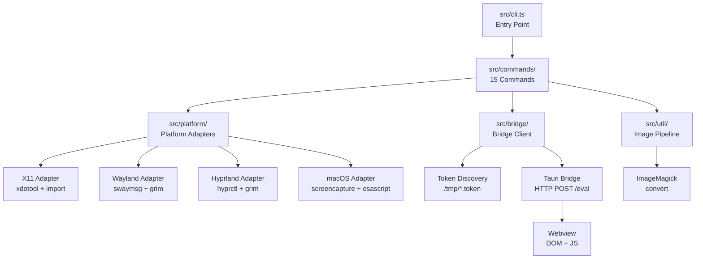

# Architecture Overview

## High-Level Architecture



## Module System

- **ESM** with `"type": "module"` in `package.json`
- **NodeNext** module resolution — all imports use `.js` extensions
- TypeScript compiles to `dist/` with declarations

## Entry Point

`src/cli.ts` creates the `commander` program and registers all 14 commands. It also manages:

- **Platform adapter creation** via `getAdapter()` — lazy initialization with tool checking
- **Display server detection** — delegates to `detectDisplayServer()` in `src/platform/detect.ts`

## Command Pattern

Each command file exports a `registerXxx(program, ...)` function:

- **Platform-dependent commands** (`screenshot`, `info`, `wait`, `list-windows`) receive `getAdapter` as a parameter
- **Bridge-dependent commands** (`dom`, `eval`, `ipc-monitor`, `console-monitor`, `storage`, `page-state`, `mutations`) use `resolveBridge()` from `shared.ts`
- **Both** (`screenshot` with `--selector`, `wait`, `snapshot`) use both adapter and bridge
- **Local-only commands** (`diff`) operate on local files with no bridge or adapter

`src/commands/shared.ts` provides two utilities:

- `addBridgeOptions(cmd)` — adds `--port` and `--token` options to a command
- `resolveBridge(opts)` — auto-discovers or uses explicit bridge config, returns `BridgeClient`

## Platform Adapter Interface

All adapters implement the `PlatformAdapter` interface from `src/types.ts`:

```typescript
interface PlatformAdapter {
  findWindow(title: string): Promise<string>;
  captureWindow(windowId: string, format: ImageFormat): Promise<Buffer>;
  getWindowGeometry(windowId: string): Promise<WindowInfo>;
  getWindowName(windowId: string): Promise<string>;
  listWindows(): Promise<WindowInfo[]>;
}
```

Adapters are in `src/platform/`:

| Adapter | File | Tools |
|---------|------|-------|
| X11 | `x11.ts` | `xdotool`, `import`, `convert` |
| Wayland | `wayland.ts` | `swaymsg`, `grim`, `convert` |
| Hyprland | `hyprland.ts` | `hyprctl`, `grim`, `convert` |
| macOS | `macos.ts` | `screencapture`, `osascript`, `sips`, `convert` |

## Bridge Client

`src/bridge/client.ts` provides the `BridgeClient` class:

- `eval(js, timeout?)` — evaluate JS in the webview via HTTP POST
- `getElementRect(selector)` — get `getBoundingClientRect()` for an element
- `getViewportSize()` — get `window.innerWidth/innerHeight`
- `getDocumentTitle()` — get `document.title`
- `getAccessibilityTree(selector, depth)` — walk the accessibility tree
- `fetchLogs(timeout?)` — fetch Rust log entries from the `/logs` endpoint
- `ping()` — check if the bridge is reachable

## Token Discovery

`src/bridge/tokenDiscovery.ts` handles bridge auto-discovery:

1. Scan `/tmp/` for files matching `tauri-dev-bridge-*.token`
2. Parse each as JSON: `{ port, token, pid }`
3. Check PID liveness via `process.kill(pid, 0)`
4. Remove stale token files from dead processes
5. Return the first live bridge config

Also exports `discoverBridgesByPid()` for `list-windows` to map PIDs to bridge configs.

## Image Pipeline

`src/util/image.ts` handles image processing:

- `cropImage(buffer, rect, format)` — crops via `convert` stdin/stdout
- `resizeImage(buffer, maxWidth, format)` — resizes via `convert` stdin/stdout
- `computeCropRect(elementRect, viewport, windowGeometry)` — computes the crop region accounting for window decorations

`src/util/exec.ts` provides the secure `exec()` wrapper:

- Uses `execFile()` with array arguments (never shell strings)
- `validateWindowId()` enforces `/^\d+$/` pattern
- 100MB max buffer for large screenshots

## Key Source Locations

| Location | Purpose |
|----------|---------|
| `src/cli.ts` | Entry point — registers commands |
| `src/types.ts` | Shared types |
| `src/commands/shared.ts` | Bridge option wiring |
| `src/platform/detect.ts` | Display server detection |
| `src/bridge/client.ts` | HTTP bridge client |
| `src/bridge/tokenDiscovery.ts` | Token file scanning |
| `src/util/image.ts` | ImageMagick operations |
| `src/util/exec.ts` | Secure process execution |
