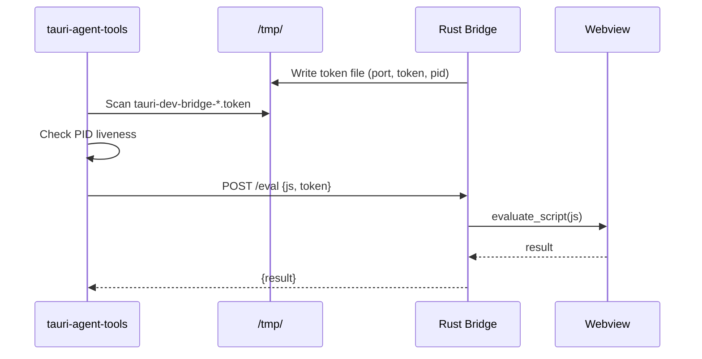

# Bridge Setup

The dev bridge is a lightweight HTTP server that runs inside your Tauri app during development. It allows tauri-agent-tools to evaluate JavaScript in the webview for DOM-targeted screenshots and inspection.

## Setup Steps

### 1. Add dependencies

Add to your Tauri project's `Cargo.toml`:

```toml
[dependencies]
tiny_http = "0.12"
serde = { version = "1", features = ["derive"] }
serde_json = "1"
scopeguard = "1"
rand = "0.8"
```

### 2. Copy the bridge module

Copy `examples/tauri-bridge/src/dev_bridge.rs` from the tauri-agent-tools package into your Tauri project's `src/` directory:

```bash
cp "$(npm root -g)/tauri-agent-tools/examples/tauri-bridge/src/dev_bridge.rs" src/
```

### 3. Wire into main.rs

```rust
mod dev_bridge;

fn main() {
    tauri::Builder::default()
        .setup(|app| {
            if cfg!(debug_assertions) {
                if let Err(e) = dev_bridge::start_bridge(app.handle()) {
                    eprintln!("Warning: Failed to start dev bridge: {e}");
                }
            }
            Ok(())
        })
        .run(tauri::generate_context!())
        .expect("error while running tauri application");
}
```

### 4. Verify

Start your Tauri app in dev mode, then:

```bash
tauri-agent-tools list-windows --tauri
tauri-agent-tools dom --depth 2
```

## How It Works



1. Bridge starts an HTTP server on a random localhost port
2. A token file with `{ port, token, pid }` is written to `/tmp/`
3. `tauri-agent-tools` discovers the token file and authenticates via the token
4. Requests are `POST /eval { js, token }` — the bridge evaluates JS in the webview
5. The token file is cleaned up when the app exits (via `scopeguard`)

## Security

- **Localhost only** — the bridge binds to `127.0.0.1`
- **Token authenticated** — every request requires a random 32-character token
- **Development only** — wrapped in `cfg!(debug_assertions)`, stripped in release builds
- **Read-only** — tauri-agent-tools only reads DOM state, never injects input

## Troubleshooting

### "No bridge found"

The CLI couldn't find a token file in `/tmp/`. Check:

- Is the Tauri app running in **dev mode** (`cargo tauri dev`)?
- Is `dev_bridge::start_bridge()` being called in `.setup()`?
- Is `cfg!(debug_assertions)` true (dev mode, not release)?
- Check for token files: `ls /tmp/tauri-dev-bridge-*.token`

### Stale token files

If the Tauri app crashes without cleanup, stale token files may remain. The CLI automatically detects these by checking PID liveness and removes them. You can also clean up manually:

```bash
rm /tmp/tauri-dev-bridge-*.token
```

### Port conflicts

The bridge binds to a random port. If you need a specific port, modify `dev_bridge.rs` to use a fixed port. The CLI supports `--port` and `--token` flags to connect to a specific bridge:

```bash
tauri-agent-tools dom --port 9876 --token your-token
```

## Agent-Assisted Setup

If you're using an AI coding agent (Claude Code, Codex, Cursor, etc.), the `tauri-bridge-setup` skill can guide automated setup. See `.agents/skills/tauri-bridge-setup/SKILL.md`.
