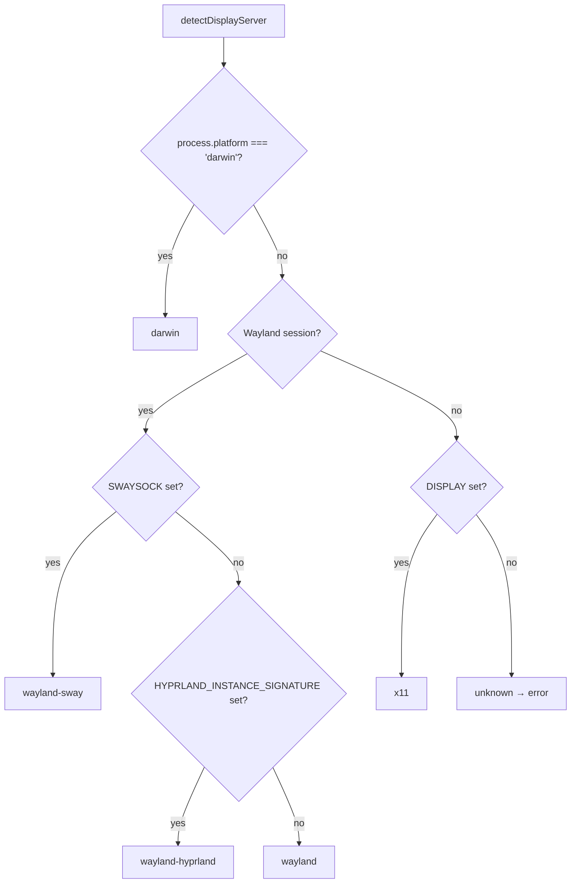

# Platform Support

## Platform Matrix

| Platform | Display Server | Status | Screenshot | Window List | Window Geometry |
|----------|---------------|--------|:----------:|:-----------:|:---------------:|
| Linux | X11 | Supported | `import` | `xdotool` | `xdotool` |
| Linux | Wayland (Sway) | Supported | `grim` | `swaymsg` | `swaymsg` |
| Linux | Wayland (Hyprland) | Supported | `grim` | `hyprctl` | `hyprctl` |
| macOS | CoreGraphics | Supported | `screencapture` | `osascript` | `osascript` |
| Windows | — | Planned | — | — | — |

## Display Server Detection

The CLI automatically detects the display server at startup:



## Platform Details

=== "Linux X11"

    **Required tools:**

    | Tool | Package | Purpose |
    |------|---------|---------|
    | `xdotool` | `xdotool` | Window search, geometry, listing |
    | `import` | `imagemagick` | Window screenshot capture |
    | `convert` | `imagemagick` | Image crop and resize |

    ```bash
    sudo apt install xdotool imagemagick
    ```

    **How it works:**

    - `xdotool search --name <regex>` finds windows by title
    - `xdotool getwindowgeometry <id>` gets position and size
    - `import -window <id> png:-` captures window pixels to stdout
    - `convert` crops and resizes via stdin/stdout pipes

=== "Linux Wayland (Sway)"

    **Required tools:**

    | Tool | Package | Purpose |
    |------|---------|---------|
    | `swaymsg` | `sway` | Window listing and geometry via IPC |
    | `grim` | `grim` | Screenshot capture |
    | `convert` | `imagemagick` | Image crop and resize |

    ```bash
    sudo apt install sway grim imagemagick
    ```

    **How it works:**

    - `swaymsg -t get_tree` lists all windows with geometry
    - `grim -g <geometry>` captures a screen region
    - `convert` crops and resizes via stdin/stdout pipes

    !!! warning "Compositor Support"
        Other Wayland compositors (GNOME, KDE) would need their own adapters. Currently Sway and Hyprland are supported.

=== "Linux Wayland (Hyprland)"

    **Required tools:**

    | Tool | Package | Purpose |
    |------|---------|---------|
    | `hyprctl` | Hyprland | Window listing and geometry via IPC |
    | `grim` | `grim` | Screenshot capture |
    | `convert` | `imagemagick` | Image crop and resize |

    ```bash
    sudo apt install grim imagemagick
    # hyprctl is included with Hyprland
    ```

    **How it works:**

    - `hyprctl clients -j` lists all windows with geometry as JSON
    - `grim -g <geometry>` captures a screen region
    - `convert` crops and resizes via stdin/stdout pipes

=== "macOS"

    **Required tools:**

    | Tool | Package | Purpose |
    |------|---------|---------|
    | `screencapture` | Built-in | Window screenshot capture |
    | `osascript` | Built-in | Window search and geometry via AppleScript |
    | `sips` | Built-in | Image format info |
    | `convert` | `imagemagick` | Image crop and resize |

    ```bash
    brew install imagemagick
    ```

    **How it works:**

    - AppleScript queries `System Events` for window properties
    - `screencapture -l <windowId>` captures a specific window
    - `convert` crops and resizes via stdin/stdout pipes

    !!! note "Screen Recording Permission"
        macOS requires Screen Recording permission for `screencapture`. Grant it in **System Settings > Privacy & Security > Screen Recording** for your terminal application.

=== "Windows (Planned)"

    Windows support is planned but not yet implemented. Contributions welcome!

    Potential approach: PowerShell for window enumeration, .NET APIs for screenshot capture.

## Tool Verification

The CLI checks for required tools on first use and reports missing ones:

```bash
$ tauri-agent-tools list-windows
Error: Missing required tools:
  xdotool: sudo apt install xdotool
  import: sudo apt install imagemagick
```

Tools are only checked once per session. The check runs on the first command that needs platform tools (screenshot, info, list-windows, wait with `--title`).
